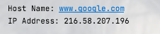
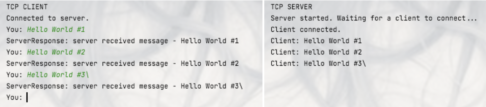
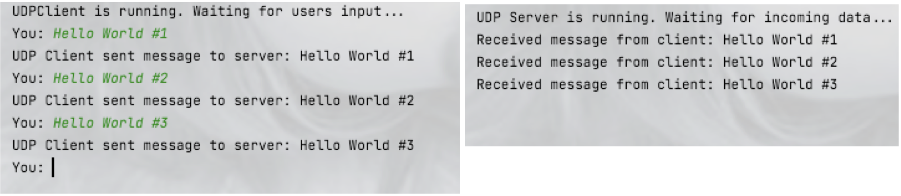
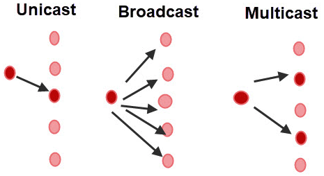

# 8.Network <hr>

## 8.1 Network fundamentals, client-server architecture communication protocols

In modern computer networks, communication between devices is based on the client-server architecture, called TCP/IP (Transmission
Control Protocol/Internet Protocol), where clients request services or resources from servers. In simple terms - imagine you're
visiting a restaurant. In this scenario, you, as a customer, represent the client. You have certain needs, such as ordering food
and requesting service. The restaurant, on the other hand, represents the server. It has resources (food, staff, kitchen) that can
fulfill your needs. Similarly, in client-server architecture, the client is like a customer who sends requests for services or
resources to the server. The server is like the restaurant, which processes these requests and provides the requested services or
resources back to the client. In different words ordering food in restaurant means sending a 'request' to kitchen.

This communication relies on various protocols that govern how data is transmitted and received. Here are some key concepts with
examples:

+ IP Addresses: An IP(Internet Protocol) address is a unique identifier assigned to each device on a network. It consists of a
  series of numbers separated by dots. There are two main versions of the Internet Protocol in use today: IPv4 (Internet Protocol
  version 4) and IPv6 (Internet Protocol version 6). IPv4 addresses are 32-bit numeric addresses, expressed in a format like "
  192.168.1.1," while IPv6 addresses are 128-bit hexadecimal addresses, represented in a format like "2001:0db8:85a3:0000:0000:
  8a2e:0370:7334. In Java, you can represent an IP address using the InetAddress class.

```java
class Network {
  public static void main(String[] args) {
    try {
      InetAddress googleAddress = InetAddress.getByName("www.google.com");
      System.out.println("Host Name: " + googleAddress.getHostName());
      System.out.println("IP Address: " + googleAddress.getHostAddress());
    } catch (UnknownHostException e) {
      System.out.println("Unable to resolve host");
    }
  }
}
```

##### Output: <br/> 

+ Ports: Ports are used to identify specific processes or services running on a device. They are represented by numeric values
  ranging from 0 to 65535. Ports below 1024 are considered well-known ports and are typically reserved for specific services. For
  example, port 80 is commonly used for HTTP traffic, port 443 is used for HTTPS traffic, and so on. ports above 1024 are
  available for general use. You can choose any available port number to establish your client-server connection, as long as it is
  not being used by another application on the same machine. It's common practice to choose port numbers above 1024 to avoid
  conflicts with well-known ports. <br/>
  To give you an analogy:
  Think of IP addresses as street addresses for houses. Each house (device) has a unique street address (IP address) to identify
  its location. Ports are like room numbers inside each house. Each room (port) can be used for different activities or
  conversations (communication sessions) independently from each other. <br/>
  In Java, you can use the Socket class to establish connections to specific ports on remote servers.

```java
class Network {
  public static void main(String[] args) {
    String serverName = "example.com";
    int portNumber = 80;
    try (Socket socket = new Socket(serverName, portNumber)) {
      // Connection established
      // Perform further operations
    } catch (IOException e) {
      // Handle exception
    }
  }
}
```

+ Network Layers: Computer networks are organized into layers, each responsible for specific tasks. Imagine a cake with multiple
  layers. Each layer has a specific purpose and contributes to the overall structure and taste of the cake. Similarly, in a
  computer network, each layer is responsible for specific tasks related to data transmission and communication. The most commonly
  used model for network layers is the "OSI (Open Systems Interconnection) model." It consists of seven layers, each with its own
  unique role:
  + Physical Layer: This is the bottom layer and deals with the physical transmission of raw bits over a physical medium, such as
    cables or wireless signals. It handles tasks like converting digital data into electrical signals for transmission.
  + Data Link Layer: This layer manages the reliable transmission of data frames between devices on the same local network. It
    also handles error detection and correction to ensure data integrity.
  + Network Layer(Internet Layer): The network layer is responsible for routing data packets from the source to the destination
    across multiple networks. It uses IP addresses to identify devices and determine the best path for data delivery.
  + Transport Layer: This layer focuses on end-to-end communication and manages data flow between applications. It ensures
    reliable and orderly data transfer and provides error recovery mechanisms. This layer includes both the Transmission Control
    Protocol (TCP) and the User Datagram Protocol (UDP). TCP provides reliable, connection-oriented data transmission, ensuring
    that data packets are delivered in the correct order and without errors. UDP, on the other hand, is connectionless and used
    for applications that require faster data transmission, such as video streaming and online gaming.
  + Session Layer: The session layer establishes, maintains, and terminates communication sessions between applications on
    different devices. It manages the dialogue and synchronization between applications.
  + Presentation Layer: This layer is responsible for data formatting, compression, and encryption. It ensures that data from the
    application layer is presented in a readable and understandable format for transmission.
  + Application Layer: The top layer is the one closest to the user and interacts directly with applications. It provides services
    to end-user applications, such as HTTP (for web browsing), SMTP (for email), FTP (for file transfer), and DNS (for domain name
    resolution).

<hr>

## 8.2 TCP (Transmission Control Protocol):

### <u>TCP Overview and communication:</u>

TCP (Transmission Control Protocol) is a widely used communication protocol in computer networks. It operates at the Transport
Layer (Layer 4) of the OSI model and provides reliable, connection-oriented communication between two devices over a network. TCP
is responsible for ensuring that data is delivered accurately, in the correct order, and without errors. TCP enables the
establishment of a connection between a client and a server, ensuring that data is transmitted accurately. The process of
establishing a TCP connection is known as the <b>TCP three-way handshake:</b>

1. The client sends a SYN (Synchronize) packet to the server, requesting to establish a connection.
2. The server responds with a SYN-ACK (Synchronize-Acknowledge) packet, acknowledging the request and agreeing to establish a
   connection.
3. The client sends an ACK (Acknowledge) packet to the server, confirming the connection establishment.

Once the connection is established, data can be exchanged bidirectionally between the client and the server. TCP ensures that data
packets are delivered reliably by using acknowledgments and retransmissions if packets are lost or corrupted.

Let's investigate with real-life example:

+ <b>Client Requests to Watch a YouTube Video:</b> When you click on a YouTube video to watch, your web browser sends a request to
  YouTube's servers, asking for the video data.
+ <b>Finding DNS (Domain Name System):</b> Before initiating the TCP handshake, your web browser first needs to find the IP
  address of YouTube's server. It does this by querying a DNS server, which translates the human-readable domain name "
  youtube.com" into the corresponding IP address.
+ <b>TCP Handshake - Establishing Connection:</b> After obtaining the IP address, your browser can now establish a connection with
  YouTube's server using the TCP handshake:
  + Step 1: Your browser sends a "hello" message called a SYN packet to YouTube's server.
  + Step 2: YouTube's server responds with a "
    hello back" message called a SYN-ACK packet, acknowledging the receipt of the SYN packet.
  + Step 3: Your browser sends another message called an ACK packet to YouTube's server, confirming the receipt of the SYN-ACK
    packet.
+ <b>Data Transmission - Watching the Video:</b> With the connection established, YouTube's server starts sending the video data
  to your web browser. The video is divided into small data packets.
+ <b>Packet Acknowledgment:</b> As your browser receives each data packet, it sends an acknowledgment back to YouTube's server,
  indicating successful receipt. If any packet is lost or corrupted during transmission, the server retransmits it to ensure data
  integrity.
+ <b>Video Playback:</b> As the data packets are received and assembled in the correct order, your web browser starts playing the
  video. This process continues until the entire video is played.
+ <b>Connection Termination - Closing the Connection:</b> After you finish watching the video or close the YouTube page, your
  browser initiates the connection termination process:
  + Step 4: Your browser sends a "goodbye" message called a FIN packet to YouTube's server, indicating that it wants to close the
    connection.
  + Step 5: YouTube's server responds with a "goodbye back" message called a FIN-ACK packet, acknowledging the receipt of the FIN
    packet.
  + Step 6: Your browser sends a final acknowledgment called an ACK packet to YouTube's server, confirming the receipt of the
    FIN-ACK packet.
+ <b>Connection Closed:</b> Both your web browser and YouTube's server now close the connection, completing the TCP process.

Throughout this TCP process, the handshake ensures a reliable and orderly data exchange between your browser and YouTube's server.
It guarantees that the video data arrives intact and in the correct sequence, enabling you to enjoy a smooth and uninterrupted
video playback experience.

### <u>Socket Programming:</u>

In Java, developers can use Socket Programming to implement TCP connections between client and server applications. Java provides
the `Socket` and `ServerSocket` classes to facilitate this:

+ The `Socket` class represents the endpoint of a two-way communication link between a client and a server. It allows data to be
  sent and received over the network.
+ The `ServerSocket` class represents a server-side socket that listens for incoming client connection requests. When a client
  requests a connection, the `ServerSocket` creates a new `Socket` to handle communication with that client.

Here's a simple Java example demonstrating TCP communication between a client and a server on local machine:

<b> TCP Server </b>

```java
public class TCPServer {
  public static void main(String[] args) {
    try {
      System.out.println("TCP SERVER");
      ServerSocket serverSocket = new ServerSocket(12345); // Port number for communication
      System.out.println("Server started. Waiting for a client to connect...");

      Socket clientSocket = serverSocket.accept(); // Wait for a client to connect
      System.out.println("Client connected.");

      BufferedReader in = new BufferedReader(new InputStreamReader(clientSocket.getInputStream()));
      PrintWriter out = new PrintWriter(clientSocket.getOutputStream(), true);

      // Server continuously listens for messages from the client
      while (true) {
        String message = in.readLine();
        if (message == null) {
          System.out.println("Client disconnected.");
          break;
        }
        System.out.println("Client: " + message);

        // Echo the message back to the client
        out.println("server received message - " + message);
      }

      in.close();
      out.close();
      clientSocket.close();
      serverSocket.close();
    } catch (IOException e) {
      e.printStackTrace();
    }
  }
}
```

<b> TCP Client </b>

```java
public class TCPClient {
  public static void main(String[] args) {
    try {
      System.out.println("TCP CLIENT");
      Socket clientSocket = new Socket("localhost", 12345); // Connect to the server on localhost:12345
      System.out.println("Connected to server.");

      BufferedReader in = new BufferedReader(new InputStreamReader(clientSocket.getInputStream()));
      PrintWriter out = new PrintWriter(clientSocket.getOutputStream(), true);
      BufferedReader consoleInput = new BufferedReader(new InputStreamReader(System.in));

      // Client continuously listens for console input and sends it to the server
      while (true) {
        System.out.print("You: ");
        String message = consoleInput.readLine();
        if (message.equalsIgnoreCase("exit")) {
          break;
        }
        out.println(message);

        String response = in.readLine();
        System.out.println("ServerResponse: " + response);
      }

      in.close();
      out.close();
      consoleInput.close();
      clientSocket.close();
    } catch (IOException e) {
      e.printStackTrace();
    }
  }
}
```

First you need to run Server side application. Then start Client side application. They will establish connection, allowing server
to listen everything is typed in console on client side. <br/>


## 8.3 UDP (User Datagram Protocol):

### <u>UDP Overview and communication:</u>

UDP is one of the core protocols of the Internet Protocol (IP) suite and operates at the Transport Layer (Layer 4) of the OSI
model. Unlike TCP, UDP is a connectionless, unreliable, and datagram-oriented protocol. It provides a simple, low-overhead, and
fast communication mechanism for transmitting data packets over a network.

<b>Key Characteristics of UDP:</b>

+ Connectionless: Unlike TCP, UDP does not establish a connection before sending data. Each UDP packet is treated independently
  and can take different routes to reach its destination.
+ Unreliable: UDP does not guarantee delivery of packets. It does not provide mechanisms for acknowledgment or retransmission of
  lost packets. If a packet is lost during transmission, it will not be retransmitted.
+ Datagram-Oriented: UDP sends and receives data in discrete packets known as datagrams. Each datagram is an independent unit that
  contains the necessary information to reach its destination.
+ Low Overhead: Because UDP does not have the additional overhead of establishing connections and ensuring reliability, it is a
  lightweight protocol suitable for applications where occasional data loss is acceptable.

<b>Use Cases of UDP:</b>

+ Real-Time Applications: UDP is commonly used in real-time applications such as video streaming, VoIP (Voice over Internet
  Protocol), and online gaming. These applications require low latency and can tolerate occasional packet loss without significant
  impact.
+ Broadcasting and Multicasting: UDP supports broadcasting and multicasting, making it suitable for scenarios where data needs to
  be sent to multiple recipients simultaneously.
+ Network Monitoring and Management: UDP is often used for network monitoring and management tasks, where small, periodic packets
  are sent to monitor network performance.
+ DNS (Domain Name System): UDP is used for DNS queries, where quick responses are required for domain name resolution.

### <u>Datagram Programming:</u>

In Java, communication using UDP is achieved through the `DatagramPacket` and `DatagramSocket` classes. `DatagramPacket`
represents a UDP packet, and `DatagramSocket` represents a socket that sends or receives these packets. Here's a simple Java
example demonstrating UDP communication between a client and a server on local machine:

<b> UDP Server </b>

```java
public class UDPServer {
    public static void main(String[] args) {
        try {
            DatagramSocket serverSocket = new DatagramSocket(8888);
            byte[] receiveBuffer = new byte[1024];                      // Create a buffer to hold incoming data

            // Create a DatagramPacket to receive data from the client
            DatagramPacket receivePacket = new DatagramPacket(receiveBuffer, receiveBuffer.length);
            System.out.println("UDP Server is running. Waiting for incoming data...");
            while (true) {
                serverSocket.receive(receivePacket);        // Receive data from the client
                String receivedMessage = new String(receivePacket.getData(), 0, receivePacket.getLength());
                if (receivedMessage.isEmpty()) {
                    break;
                }
                System.out.println("Received message from client: " + receivedMessage);
            }
            serverSocket.close();
        } catch (IOException e) {
            e.printStackTrace();
        }
    }
} 
```

<b> UDP Client </b>

```java
public class UDPClient {
    public static void main(String[] args) {
        try {
            System.out.println("UDPClient is running. Waiting for users input...");
            DatagramSocket clientSocket = new DatagramSocket();
            InetAddress serverAddress = InetAddress.getByName("localhost");
            int serverPort = 8888;
            BufferedReader consoleInput = new BufferedReader(new InputStreamReader(System.in));

            while (true) {
                System.out.print("You: ");
                String message = consoleInput.readLine();
                if (message.equalsIgnoreCase("exit")) {
                    break;
                }
                byte[] sendData = message.getBytes();

                // Create a DatagramPacket to send data to the server
                DatagramPacket sendPacket = new DatagramPacket(sendData, sendData.length, serverAddress, serverPort);
                clientSocket.send(sendPacket);
                System.out.println("UDP Client sent message to server: " + message);

            }
            // Send empty request to force server shutdown
            clientSocket.send(new DatagramPacket(new byte[0], 0, serverAddress, serverPort));
            clientSocket.close();
        } catch (IOException e) {
            e.printStackTrace();
        }
    }
}
```

Run server side, run client side. No connection establishing is required. You can type into clients console to see result on
server side. <br/>


### <u>MulticastSocket:</u>

`MulticastSocket` is a specialized class in Java that extends `DatagramSocket` and allows applications to participate in multicast
group communication using the User Datagram Protocol (UDP). Multicast communication is a one-to-many or many-to-many form of
communication where a single sender can send data to multiple receivers, known as a multicast group, simultaneously.

<b> Key features of MulticastSocket: </b>

+ Joining Multicast Group: A `MulticastSocket` can join a specific multicast group by specifying the multicast group address. Once
  joined, the socket can receive multicast data sent to that group.
+ Sending Multicast Data: A `MulticastSocket` can also send data to a multicast group. When data is sent, all the members of the
  multicast group receive the data.
+ IP Multicast Addresses: Multicast communication uses specific IP multicast addresses, which are in the range of 224.0.0.0 to
  239.255.255.255. These addresses are reserved for multicast group communication.
+ Firewall and Network Configuration: Multicast communication may require special configurations in firewalls and routers to allow
  multicast traffic to flow between sender and receiver hosts.

<b> Usage of MulticastSocket: </b>

`MulticastSocket` is often used in scenarios where data needs to be distributed to multiple receivers efficiently. Some common use
cases of multicast communication include real-time multimedia streaming, online gaming, and distributed simulations.

The main difference between `MulticastSocket` and `DatagramSocket` lies in their communication patterns and use cases:

<b> DatagramSocket: </b>

+ `DatagramSocket` is used for both unicast and broadcast communication.
+ It is a simple, connectionless, and unreliable protocol that operates on the UDP (User Datagram Protocol) level.
+ With `DatagramSocket`, data packets (datagrams) are sent from one point to another without establishing a connection between
  sender and receiver.
+ It is suitable for scenarios where real-time communication is needed, but reliability and ordered delivery are not critical. For
  example, in multimedia streaming, online gaming, or IoT applications.

<b> MulticastSocket: </b>

+ `MulticastSocket` is used specifically for multicast communication, which is a form of one-to-many communication.
+ It operates on top of the UDP protocol and is based on IP multicast, where a single sender can send data to multiple receivers
  in a multicast group.
+ The receivers must join the multicast group before they can start receiving the data.
+ It is suitable for scenarios where data needs to be efficiently broadcasted to multiple recipients within a local network or
  multicast-enabled network.

In summary, the key distinction is that DatagramSocket is used for general unicast and broadcast communication over UDP, whereas
MulticastSocket is specialized for one-to-many communication using IP multicast.</br>


## 8.4 URL and URLConnection:

### <u> URL (Uniform Resource Locator): </u>

A URL (Uniform Resource Locator) is a reference or address that points to a specific resource on the internet. It identifies the
location of a resource, such as a webpage, an image, a file, or any other content accessible through the internet. A URL typically
consists of the following components:

+ Protocol: The protocol used to access the resource, such as "http," "https," "ftp," etc.
+ Host: The domain name or IP address of the server where the resource is located.
+ Port: The port number on the server that the client should connect to (optional). For example, the default port for HTTP is 80,
  and for HTTPS is 443.
+ Path: The specific path or file on the server that the client wants to access.
+ Query: Optional parameters that are sent to the server for processing the request. Example of a
  URL: <b> https://www.example.com:8080/path/to/resource?param1=value1&param2=value2 </b>

### <u> URLConnection: </u>

URLConnection is a Java abstract class that represents a connection to a URL resource. It allows you to open a connection to the
resource specified by the URL and provides methods for interacting with the resource, such as reading data, writing data, setting
request headers, etc. URLConnection provides a common set of methods to work with various types of resources, such as web pages,
files, images, etc. It can be used to send requests to a server and retrieve data from it. Here's a basic outline of how to use
URL and URLConnection in Java:

```java
public class URLConnectionClient {
    public static void main(String[] args) {
        try {
            URL url = new URL("https://www.example.com");
            URLConnection connection = url.openConnection();
            connection.connect();

            // Read data from the URL
            BufferedReader reader = new BufferedReader(new InputStreamReader(connection.getInputStream()));
            String line;
            while ((line = reader.readLine()) != null) {
                System.out.println(line);
            }
            reader.close();
        } catch (IOException e) {
            e.printStackTrace();
        }
    }
}
```

## 8.5 HTTP and HTTPS:

### <u> HTTP, HTTPS overview: </u>

<b> HTTP (Hypertext Transfer Protocol): </b>

HTTP (Hypertext Transfer Protocol) is an application layer protocol widely used for communication between clients and servers on
the World Wide Web. It is the foundation of data communication on the internet and allows the transfer of various types of
resources, such as HTML documents, images, videos, and more. The HTTP protocol operates as a request-response protocol, where a
client sends an HTTP request to a server, and the server responds with an HTTP response. HTTP requests typically include methods
such as GET (retrieve data), POST (submit data), PUT (update data), DELETE (remove data), and more. HTTP is considered stateless,
meaning each request from a client to the server is independent of previous requests. To maintain user sessions and stateful
interactions, additional mechanisms like cookies or sessions are often used.

<b> HTTPS (Hypertext Transfer Protocol Secure): </b>

HTTPS (Hypertext Transfer Protocol Secure) is a secure version of HTTP that encrypts the data exchanged between the client and the
server using a cryptographic protocol called SSL/TLS (Secure Sockets Layer/Transport Layer Security). It ensures secure
communication and protects sensitive information from eavesdropping and unauthorized access. When a client makes an HTTPS request
to a server, the communication starts with a "handshake" where the client and server agree on encryption algorithms and exchange
digital certificates to verify their identities. Once the handshake is successful, data is encrypted before transmission and
decrypted upon reception. The main difference between HTTP and HTTPS is the security aspect. HTTPS is commonly used for websites
that handle sensitive information, such as online banking, e-commerce, login pages, and any other scenario where data privacy and
security are crucial.

<b> Key Differences between HTTP and HTTPS: </b>

+ Security: HTTP does not provide data encryption, making it susceptible to interception and tampering. In contrast, HTTPS
  encrypts data, ensuring secure communication.
+ URL Format: HTTP URLs begin with "http://" and HTTPS URLs begin with "https://".
+ Port: HTTP typically uses port 80 for communication, while HTTPS uses port 443.
+ SSL/TLS Certificate: HTTPS requires an SSL/TLS certificate to establish a secure connection between the client and the server.

```java
public class HTTPConnectionClient {
    public static void main(String[] args) {
        try {
            URL url = new URL("http://www.example.com");
            HttpURLConnection conn = (HttpURLConnection) url.openConnection();
            conn.setRequestMethod("GET");

            BufferedReader reader = new BufferedReader(new InputStreamReader(conn.getInputStream()));
            String line;
            while ((line = reader.readLine()) != null) {
                System.out.println(line);
            }
            reader.close();
        } catch (IOException e) {
            e.printStackTrace();
        }
    }
}
```

Please note that in a real-world scenario, if you need to make HTTPS requests, you should use libraries like Apache HttpClient or
Java's `HttpsURLConnection` to handle SSL/TLS certificates and ensure secure communication.

### <u> HTTPUrlConnection vs URLConnection </u>

`URLConnection` and `HttpURLConnection` are both classes in Java used to handle network connections and communicate with web
servers. The main difference between them is that `HttpURLConnection` is a subclass of `URLConnection` that specifically handles
HTTP connections.

+ URLConnection:
    + `URLConnection` is an abstract class that represents a connection to a URL.
    + It can be used for all types of URL connections, including HTTP, FTP, and others.
    + `URLConnection` provides a generic set of methods for connecting to a URL, setting request headers, and reading the
      response.
    + It is a more general-purpose class and can be used for any type of network communication.


+ HttpURLConnection:
    + `HttpURLConnection` is a subclass of URLConnection that is specifically designed to handle HTTP connections.
    + It provides additional methods and functionalities that are specific to HTTP, such as setting request methods (GET, POST,
      etc.), handling HTTP headers, and reading HTTP responses.
    + `HttpURLConnection` is more specialized and tailored for making HTTP requests and receiving HTTP responses.

In summary, URLConnection is a more generic class that can handle various types of URL connections, while HttpURLConnection is a
subclass of URLConnection that is specifically designed for HTTP connections. If you are working with HTTP requests, it is
recommended to use HttpURLConnection as it provides additional features and convenience methods specific to HTTP communication.

### <u> URLConnection subclasses </u>

As mentioned before in Java, there are several classes that extend URLConnection or are related to it for handling different types
of URL connections. Here is a list of some of the most commonly used classes related to URL connections:

+ URLConnection: The abstract class representing a connection to a URL. It is the superclass for specific URL connection classes.
+ HttpURLConnection: A subclass of URLConnection specifically designed to handle HTTP connections.
+ HttpsURLConnection: A subclass of HttpURLConnection used for secure HTTPS connections.
+ JarURLConnection: A subclass of URLConnection used for connecting to JAR files.
+ FileURLConnection: A subclass of URLConnection used for connecting to files on the local file system.
+ FtpURLConnection: A subclass of URLConnection used for FTP connections.
+ MailtoURLConnection: A subclass of URLConnection used for mailto URL connections.
+ JdbcOdbcConnection: A subclass of URLConnection used for connecting to JDBC-ODBC bridges.
+ NetURLConnection: A subclass of URLConnection used for connecting to URLs through the net protocol.

Please note that some of the classes listed above may not be widely used or may be deprecated in newer versions of Java.
HttpURLConnection and HttpsURLConnection are among the most commonly used classes for handling HTTP and HTTPS connections in
modern Java applications.

### 8.6 Popular network frameworks:

The popularity of network frameworks can vary depending on the specific use case, industry, and project requirements. However,
some of the most widely used network frameworks in the Java ecosystem are:

1. Apache HTTPClient: Apache HTTPClient is widely used for making HTTP requests and handling HTTP-based communication in Java
   applications. It is a stable and mature library with a rich feature set, making it a popular choice for interacting with web
   services and APIs. Example of Apache library <span style="color:red">(note that you need to add external library dependency to
   your project to test yourself)</span>:

```java
import org.apache.http.HttpResponse;
import org.apache.http.client.HttpClient;
import org.apache.http.client.methods.HttpGet;
import org.apache.http.client.methods.HttpPost;
import org.apache.http.impl.client.HttpClients;
import org.apache.http.HttpEntity;
import org.apache.http.NameValuePair;
import org.apache.http.client.entity.UrlEncodedFormEntity;
import org.apache.http.message.BasicNameValuePair;

import java.io.IOException;
import java.util.Scanner;
import java.util.ArrayList;
import java.util.List;

public class HttpClientExample {

    public static void main(String[] args) throws IOException {
        HttpClient httpClient = HttpClients.createDefault();
        HttpGet httpGet = new HttpGet("https://jsonplaceholder.typicode.com/posts/1");

        HttpResponse response = httpClient.execute(httpGet);

        Scanner scanner = new Scanner(response.getEntity().getContent());
        while (scanner.hasNextLine()) {
            System.out.println(scanner.nextLine());
        }

        HttpPost httpPost = new HttpPost("https://jsonplaceholder.typicode.com/posts");

        List<NameValuePair> params = new ArrayList<>();
        params.add(new BasicNameValuePair("title", "Sample Post"));
        params.add(new BasicNameValuePair("body", "This is a sample post."));
        params.add(new BasicNameValuePair("userId", "1"));

        httpPost.setEntity(new UrlEncodedFormEntity(params));

        HttpResponse response = httpClient.execute(httpPost);
        System.out.println("Status code: " + response.getStatusLine().getStatusCode());
    }
}
```

2. Spring Web: Spring Web, part of the Spring Framework, is highly popular for building web applications and RESTful APIs. Spring
   is a widely adopted framework in the Java community, and its seamless integration with web technologies makes it a preferred
   choice for many developers. Example of RestFull application and REST call using RestTemplate <span style="color:red">(note to
   test yourself you will need to add several dependencies to your project)</span>:

```java
import org.springframework.web.bind.annotation.GetMapping;
import org.springframework.web.bind.annotation.RequestMapping;
import org.springframework.web.bind.annotation.RestController;

@RestController
@RequestMapping("/api")
public class HelloController {

    @GetMapping("/hello")
    public String hello() {
        return "Hello, Spring Web!";
    }
}
```

&nbsp;&nbsp;&nbsp;&nbsp; To make a call to another API, using this framework you can use RestTemplate object:

```java
import org.springframework.web.client.RestTemplate;

public class MyRestClient {

    private static final String BASE_URL = "https://api.example.com"; // Replace with your API base URL

    private final RestTemplate restTemplate;

    public MyRestClient() {
        this.restTemplate = new RestTemplate();
    }

    public String getExampleData() {
        String url = BASE_URL + "/endpoint"; // Replace with your specific endpoint
        return restTemplate.getForObject(url, String.class);
    }
}
```

&nbsp;&nbsp;&nbsp;&nbsp; Run the Spring Boot application, and it will start an embedded web server. You can access the API
at http://localhost:8080/api/hello. When you visit http://localhost:8080/api/hello in your web browser you will see the
response  "Hello, Spring Web!".

3. Netty: Netty is known for its high-performance networking capabilities and asynchronous programming model. It is often used in
   scenarios where low-latency and high-throughput network communication is required, such as in networking servers, real-time
   applications, and IoT devices.
4. gRPC: gRPC has gained popularity in recent years for building efficient and high-performance distributed systems. It is often
   used in microservices architectures and for communication between services in large-scale applications.
5. Java RMI (Remote Method Invocation): Java RMI is still used in specific enterprise applications, especially in cases where
   Java-to-Java communication across distributed systems is required. However, its usage may have decreased in favor of more
   modern approaches like REST and gRPC.
6. Vert.x: Vert.x is gaining popularity for building reactive and event-driven applications. Its lightweight and scalable nature
   makes it suitable for building modern applications with high concurrency and real-time capabilities.

Keep in mind that the popularity of frameworks can change over time, and the best choice depends on your specific project
requirements, team expertise, and the nature of your application. Always consider factors like community support, documentation,
and ease of integration when selecting a network framework for your Java project.

### 8.7 Network security concepts & secure communication:

Network security concepts and secure communication are essential in modern networking to protect data and ensure secure
transmission between clients and servers. Here is an overview of some key concepts and technologies related to network security:

1. <b>Confidentiality</b>: Confidentiality ensures that data remains private and is not accessible to unauthorized users.
   Encryption is commonly used to achieve confidentiality, where data is converted into a ciphertext using cryptographic
   algorithms, and only authorized parties with the decryption key can access the original data.
2. <b>Integrity</b>: Integrity ensures that data remains unchanged during transmission and storage. Hash functions are often used
   to verify data integrity. A hash function generates a fixed-size hash value from the original data, and any modification to the
   data will result in a different hash value.
3. <b>Authentication</b>: Authentication verifies the identity of users or devices in a network. It ensures that users are who
   they claim to be and have the appropriate access rights. Common authentication mechanisms include usernames/passwords, digital
   certificates, and biometrics.
4. <b>Authorization</b>: Authorization in the context of network security refers to the process of determining what actions a user
   or a system is allowed to perform within a given resource or system. It involves checking the permissions and privileges of a
   user or a system and ensuring that they have the necessary rights to access certain resources or perform specific actions.
5. <b>Digital Certificates</b>: Digital certificates are used to validate the authenticity of a website or server. They contain
   information about the identity of the owner, a public key, and a digital signature from a trusted Certificate Authority (CA).
   When a user accesses a secure website, the server presents its digital certificate to prove its authenticity.
6. <b>Transport Layer Security (TLS) / Secure Sockets Layer (SSL)</b>: TLS and SSL are cryptographic protocols that provide secure
   communication over a computer network, such as the internet. They use a combination of asymmetric and symmetric encryption to
   secure data transmission between a client and a server.
7. <b>Secure Shell (SSH)</b>: SSH is a network protocol that provides secure access to network devices and servers over an
   unsecured network. It encrypts the data transmitted between the client and the server, preventing eavesdropping and
   unauthorized access.
8. <b>Virtual Private Network (VPN)</b>: VPN is a secure tunnel that allows users to access a private network over a public
   network (
   e.g., the internet). It encrypts data and provides a secure connection, ensuring that data remains private and protected from
   interception.
9. <b>Firewalls</b>: Firewalls are network security devices that monitor and control incoming and outgoing network traffic based
   on predefined security rules. They act as a barrier between a trusted internal network and an untrusted external network,
   protecting the internal network from unauthorized access and potential threats.
10. <b>Intrusion Detection System (IDS) and Intrusion Prevention System (IPS)</b>: IDS and IPS are security mechanisms that
    monitor network traffic and detect or prevent malicious activities and attacks on the network.

Implementing these network security concepts and technologies helps ensure that data transmission is secure and protected from
unauthorized access, making it possible to establish trust in network communications and prevent data breaches and cyber-attacks.

<b> Here is an example of Basic Authentication using pure Java: </b>

```java
public class BasicAuthentication {
    public static void main(String[] args) {
        String username = "your_username";
        String password = "your_password";
        String credentials = username + ":" + password;              // Encode the username and password in Base64
        String encodedCredentials = Base64.getEncoder().encodeToString(credentials.getBytes());
        String authorizationHeader = "Basic " + encodedCredentials;     // Set the "Authorization" header with the encoded credentials
        String url = "https://api.example.com/data";
        try {
            ProcessBuilder processBuilder = new ProcessBuilder("curl", "-X", "GET", url, "-H", "Authorization: " + authorizationHeader);
            Process process = processBuilder.start();
            BufferedReader reader = new BufferedReader(new InputStreamReader(process.getInputStream()));
            String line;
            while ((line = reader.readLine()) != null) {
                System.out.println(line);
            }

            reader.close();
        } catch (IOException e) {
            e.printStackTrace();
        }
    }
}
```

<b> Here is an example of Basic Authorization using pure Java: </b>

```java
public class BasicAuthorization {
    public static void main(String[] args) {
        AuthorizationService authService = new AuthorizationService();

        // Simulate user login (you would typically have a login process in your application)
        User user = new User("alice", "password123", "admin");
        String action = "adminAction";                  // Check if the user is authorized to perform an action
        if (authService.isAuthorized(user, action)) {
            System.out.println("User is authorized to perform the action: " + action);
        } else {
            System.out.println("User is not authorized to perform the action: " + action);
        }
    }
}

class AuthorizationService {
    private List<User> users;

    public AuthorizationService() {
        users = new ArrayList<>();
        users.add(new User("alice", "password123", "admin"));
        users.add(new User("bob", "qwerty", "user"));
    }

    public boolean isAuthorized(User user, String action) {
        // In a real application, you would perform more complex logic here, e.g., checking roles against a database
        if (user == null || action == null) {
            return false;
        }

        // For this example, let's assume only the admin role is authorized to perform the action "adminAction"
        return action.equals("adminAction") && user.getRole().equals("admin");
    }
}

// User class representing a user with name, password, and role
class User {
    private String name;
    private String password;
    private String role;

    public User(String name, String password, String role) {
        this.name = name;
        this.password = password;
        this.role = role;
    }

    public String getRole() {
        return role;
    }
} 
```

<hr>
