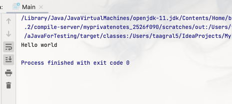

## Installing java:

### Installing:

1. Download the Java JDK(preferred 17 or 21 version from oracle website): https://www.oracle.com/java/technologies/downloads/ <b>
   MSI Installer</b> should do everything automatically. Pick installer corresponding your Operational System.
2. Once the installation is complete, verify the Java installation version. Open a terminal window or command prompt (WIN + R, type `cmd` hit enter),
   in opened window type `java -version`. If Java installed correctly response should be something like this:
   ```
      openjdk version "11.0.16.1" 2022-08-12
      OpenJDK Runtime Environment Homebrew (build 11.0.16.1+0)
      OpenJDK 64-Bit Server VM Homebrew (build 11.0.16.1+0, mixed mode)
   ```
3. Continue in terminal, verify Java Compiler version, type `javac -version`. If Java installed correctly response should be something like this:
   ```
      javac 11.0.16.1
   ```
   <b> Note in both outputs, response can differ from example !!!</b> depending on what version and package you have installed. 
   But it will not affect on development in general.
4. If both responses are printed, Java is installed properly. Skip Troubleshooting step and proceed further.

### Troubleshooting:

If one of the output responses doesn't print you anything, you can try following solutions:

+ Set the JAVA_HOME environment variable:
    + Open the System Properties window.
    + Click on the Advanced tab.
    + Click on the Environment Variables button.
    + In the User variables section, select the New button.
    + In the Variable name field, type `JAVA_HOME`.
    + In the Variable value field, browse to the installation directory of the Java JDK.
    + Click the OK button to save the changes.
+ Add Java to the PATH environment variable:
    + In the System Variables section, select the Path variable.
    + Click the Edit button.
    + Add the following path to the end of the variable value: `;%JAVA_HOME%\bin`
+ Verify that Java is added to the PATH:
    + Open a terminal window or command prompt.
    + Type the following command: `where java`
    + If Java is added to the PATH correctly, you will see the path to the java executable, similar to this:
  ```
   C:\Program Files\Java\jdk1.8.0_201\bin\java.exe
  ```

More information
here - [How to set up Java_Home](https://stackoverflow.com/questions/2619584/how-to-set-java-home-on-windows-7#:~:text=Set%20Java%20Home-,JAVA_HOME,-%3D%20C%3A%5CProgram).

### Java versions and difference between JDK & JRE:

1. Difference between Java versions. Java versions differ in terms of new features, performance enhancements, security improvements, and bug fixes.
   Each new version of Java introduces new capabilities and addresses known issues from previous versions, making it crucial for developers to stay
   updated with the latest releases. Here's a brief overview of the key differences between recent Java versions:
    * <b>Java 8 (2014) LTS:</b> Introduced lambda expressions, functional interfaces, and the Stream API, revolutionizing Java's approach to
      functional programming and data processing.
    * <b>Java 9 (2017):</b> Introduced modules, a modularity system that enhances code organization, dependency management, and security.
    * <b>Java 10 (2018):</b> Introduced local-variable type inference, making code more concise and readable.
    * <b>Java 11 (2019) LTS:</b> Introduced a long-term support (LTS) release schedule, ensuring extended support and stability for critical
      applications.
    * <b>Java 12 (2019):</b> Introduced switch expressions, providing a more versatile and concise alternative to traditional switch statements.
    * <b>Java 13 (2020):</b> Introduced text blocks, enabling multi-line text formatting without the need for escape sequences.
    * <b>Java 14 (2020):</b> Introduced record types, providing a lightweight and concise way to define data structures with getters, setters, and
      constructors.
    * <b>Java 15 (2020):</b> Introduced sealed classes, enhancing type safety and control over inheritance hierarchies.
    * <b>Java 16 (2021):</b> Introduced stream improvements, including stream flattening and vectorization, enhancing performance and reducing memory
      usage.
    * <b>Java 17 (2021) LTS:</b> Introduced switch expressions for pattern matching, enabling more flexible and expressive conditional statements.
    * <b>Java 18 (2022):</b> Introduced text blocks enhancements, allowing embedding expressions and formatting within text blocks.
    * <b>Java 19 (2022):</b> Introduced preview features for pattern matching in switch expressions, record patterns, and unnamed classes and instance
      main methods. These features aim to improve code readability, expressiveness, and conciseness.
    * <b>Java 20 (2023):</b> Introduced pattern matching for switch statements as a standard feature, along with record patterns and unnamed classes.
      It also introduced preview features for text blocks with expressions, which allow embedding expressions and formatting within text blocks.
    * <b>Java 21 (2023) LTS:</b> Introduced preview features for string templates, which provide a more concise and expressive way to format strings,
      and unnamed patterns and variables, which simplify pattern matching expressions.

More information here - [Java version history](https://en.wikipedia.org/wiki/Java_version_history).

<b>What is LTS ?</b>: LTS stands for Long Term Support. It refers to specific Java versions that Oracle designates for extended support and
maintenance. These LTS versions receive regular security updates, bug fixes, and performance enhancements for a longer period compared to non-LTS
versions. Oracle selects Java versions for LTS based on several factors, including:

* <b>Stability and Maturity</b>: LTS versions have a proven track record of stability and reliability, ensuring compatibility with existing
  applications and frameworks.
* <b>Community Adoption and Usage</b>: Widespread adoption among Java developers and organizations indicates the version's maturity and suitability
  for production environments.
* <b>Long-Term Support Commitment</b>: Oracle pledges to provide extended support for LTS versions, ensuring that users have access to security
  updates and maintenance for a longer period.
* <b>Availability of Resources</b>: LTS versions have a rich ecosystem of documentation, tutorials, and support resources, making it easier for
  developers to learn and use the version effectively.

Oracle chooses specific versions, such as 8, 11, 17, and 21, for LTS based on these factors. These versions have demonstrated stability, widespread
adoption, and a strong support ecosystem, making them suitable choices for long-term enterprise applications.

<b>Difference JRE vs JDK</b>: Java Runtime Environment (JRE) and Java Development Kit (JDK) are both essential components of the Java platform, but
they serve different purposes. Here's a simplified explanation:

* <b>Java Runtime Environment (JRE)</b> - Imagine the JRE as the engine that runs Java applications. It provides the necessary libraries and tools for
  executing Java programs. If you're just using Java to run applications, you only need the JRE.
* <b>Java Development Kit (JDK)</b> - Think of the JDK as the toolkit for creating Java applications. It includes the JRE plus additional tools and
  libraries specifically designed for Java development. If you're planning to write Java code, you need the JDK.

## Running your first Java program:

### Simple Hello World:

1. Create a folder on `Desktop`, lets call it `JavaApp`, so the final path would be something like this - `C:\Users\UserName\Desktop\JavaApp`
2. Create a text file called `Hello.java` inside folder. You can use any text editor - Notepad++ will be fine.
3. Write the following code into the file:
   ```java
   public class Hello {
      public static void main(String[] args) { 
        System.out.println("Hello world !!!"); 
      }
   }
   ```
   <b>Please note that <u>fileName.java</u> should match class <u>Name</u></b>
4. Save the file. Open terminal and navigate to the folder where the file was created. To navigate you can use two options:
    * Open RUN terminal window (WIN + R), type `cmd` hit enter. Black command prompt window should open. The opened path should be something like
      this: `C:\Users\UserName>`. Navigate to the created folder by typing command `cd ~/Desktop/JavaApp`. You will see that path have changed.
      Type `dir` command to see the content of the folder. You should see one file in the list - `Hello.java`
    * Navigate in Windows explorer to the folder. In folders address bar replace path with `cmd` and hit Enter. Black command prompt window should
      open. Opened path should be already in that folder something like this: `C:\Users\UserName\Desktop\JavaApp>`. Type `dir` command to see the
      content of the folder. You should see one file in the list - `Hello.java`
5. Call the compiler and compile the .java file with the following command `javac Hello.java`. When finished type once again `dir`, now you should see
   two Hello files with `.class` and `.java` extensions.
6. Run the .class file with the following command `java Hello`. <b>Please note you don't have to specify which Hello file extension to run. Java will
   handle this on her own</b>
7. In terminal output you should see printed line - `Hello World !!!`. Your first java app created and ran successfully.

### Java app with input arguments:

8. Create in a folder new text file called `HelloWithArguments.java`.
9. Write the following code into the file:
   ```java
   public class HelloWithArguments {
        public static void main(String[] args) {
           System.out.println("Hello " + args[0] + " !!!");
        }
   }
   ```
   <b>Please note that <u>fileName.java</u> should match class <u>Name</u></b>
10. Save file. Repeat previous steps to open folder in terminal. Now when you type `dir`, 3 files should be visible in the folder.
11. Compile new file by typing `javac HelloWithArguments.java`. The new `.class` file should be created in the folder.
12. Run the .class file with the following command `java HelloWithArguments John`. <b>Please note <u>add argument this time !</u>
    and also you don't have to specify which extension to run. </b>
13. In terminal output you should see printed line - `Hello John !!!`.

### Installing Intellij IDEA IDE (integrated development environment):

1. Head to [Intellij Idea official website](https://www.jetbrains.com/idea/download/)
2. Pick free Community Edition below corresponding your Operational System you have:
    + <b>IntelliJ IDEA Community Edition</b> is a free and open-source IDE that is suitable for a wide range of Java development tasks, including web
      development, enterprise applications, and Android development. It provides a comprehensive set of features, including code completion,
      refactoring, debugging, and code analysis.
    + <b>IntelliJ IDEA Ultimate Edition</b> is the commercial version of the IDE, and it provides a wider range of features and capabilities than the
      Community Edition. These features include:
        + Support for more programming languages and frameworks
        + More advanced code analysis and refactoring tools
        + Integrated continuous integration and deployment tools
        + Support for enterprise features, such as data virtualization and application performance management

   For testing purposes and as entry point free - Community Edition is more than enough.
3. After installation is complete, launch Intellij IDEA. You should see following start up menu:\
   
4. Press `New Project`, the following window will pop up:\
   
5. In JDK options, specify your installed Java JDK version. If Intellij IDEA doesn't find it automatically, click `Add JDK`, pick option `JDK...`,
   where you can select a path to installed Java folder.
6. Check that option `Add sample code` is checked.
7. Press `Create` and new Java project with basic code example will be created and opened instantly. You should see the following window:\
   
8. Press green small arrow button on the code line 2 to launch the project. At the bottom you will see console output will pop up, with following
   window:\
   
9. The output may vary, depending on your system configurations, but the main goal `Hello World` should present. If you see it, then Intellij IDEA is
   configured for the further work.
   